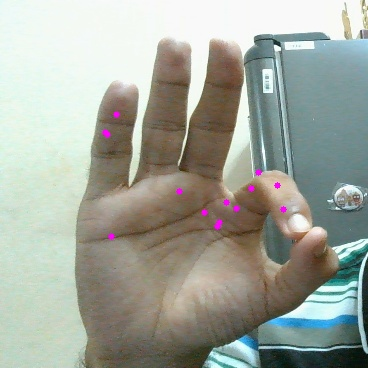

# OpenPose MobileNet Pytorch
Implementation of OpenPose MobileNet architecture using PyTorch. <br>
This implementation is inspired from the paper "Real-time 2D Multi-Person Pose Estimation on CPU:
Lightweight OpenPose". <br>
I have used "Hands from Synthetic Data" published by CMU which has 21 keypoints for every hand image. <br>
Initally, I have removed the paf maps from the architecture and have just trained the model on keypoint maps. I will add it in the subsequent commits. If you would like to contribute, please feel free to do so. <br>

## Requirements
torch>=1.2.0 <br>
opencv>=4.2.0 <br>

## Steps to run
1. Download the "Hands from Synthetic Data" from [this link](http://domedb.perception.cs.cmu.edu/panopticDB/hands/hand_labels_synth.zip) and keep the folder "hand_labels_synth" in the main directory. <br>
2. (Optional) Edit the filenames in config.py files according to your requirement. <br>
3. To prepared the dataset for training, run: <br>
```.bash
python scripts/prepare_train_labels.py
```
This create a pickle file named "synth2-synth3" (according to my config.py file) which can be used for training. <br>
4. To start the training process, run:
```.bash
python train.py
```
This will train the model and after every 5000 iterations, uses one image to predict the hand points using the trained network. <br>
5. To validate on an entire folder of images, run:
```.bash
python val.py
```
This predicts hand points for all the images in the folder and stores the result in "outputs" folder (according to my config.py). <br> <br>
I have trained the model using different hyperparameters and have had reasonable results. I am yet to find the apt hyperparameters. <br>
Below are the best results I got from using different number of stages and different batch size. <br> <br>
 <br>
Number of Stages: 2 ; Batch Size: 8 <br>
The outputs are not very accurate, but there are few hand points which are detected. <br> <br>
